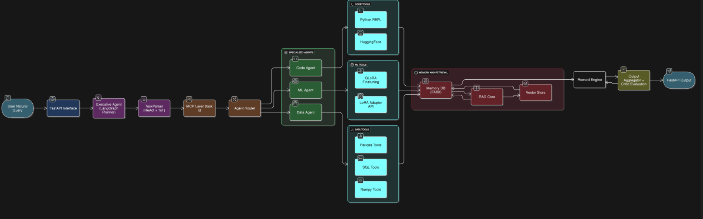

# NeuroAct AI 🧠

A multi-agent AI system with reinforcement learning capabilities, featuring specialized agents for code generation, machine learning, data processing, and task evaluation.

## 🏗️ Architecture



*System architecture showing the multi-agent workflow with Ollama integration*

### Core Components

#### 1. Task Management System (`app/mcp/`)
- **TaskManager Schema**: Pydantic-based task definition with dependencies, tools, and metadata
- **MCP Dispatcher**: Routes tasks to appropriate agents with logging and error handling

#### 2. Task Parser (`app/core/task_parser.py`)
- **Query Analysis**: Analyzes user queries and determines complexity
- **Agent Selection**: Maps keywords to appropriate agents
- **Dependency Management**: Creates task dependency chains
- **Supported Agents**:
  - DataAgent - Data preparation and cleaning
  - MLAgent - Traditional machine learning
  - DeepLearningAgent - Neural network training
  - EvalAgent - Model evaluation and metrics
  - OptimizerAgent - Hyperparameter tuning
  - VisualizationAgent - Data and results visualization
  - CriticAgent - Quality review and validation
  - RetrievalAgent - External data fetching
  - CodeAgent - Code execution (fallback)
  - PlannerAgent - Complex workflow orchestration

#### 3. Advanced Planner Agent (`app/agents/planner_agent.py`)
- **NetworkX Integration**: DAG-based task dependency management
- **LangGraph Workflow**: Async execution with state management
- **Parallel Execution**: Identifies and runs independent tasks concurrently
- **Retry Strategies**: Exponential/linear backoff for failed tasks
- **Monitoring**: Real-time progress tracking and logging
- **Timeout Handling**: Per-agent timeout configuration

#### 4. Logging System (`app/utils/logger.py`)
- **Centralized Logging**: Single logger instance across all modules
- **File + Console Output**: Dual logging destinations
- **Execution Tracking**: Performance monitoring with decorators
- **Module-specific Logs**: Separate log files per component

## Features

### Multi-Agent Orchestration
- **Query-based Agent Activation**: Only relevant agents are triggered
- **Dynamic Task Dependencies**: Automatic dependency resolution
- **Parallel Processing**: Concurrent execution of independent tasks
- **Fault Tolerance**: Retry mechanisms with configurable strategies

### Advanced Planning
- **DAG Validation**: Prevents circular dependencies
- **Topological Sorting**: Optimal execution order
- **Resource Management**: Timeout and memory monitoring
- **Progress Tracking**: Real-time execution status

### Comprehensive Tool Integration
Each agent comes with specialized tools:
- **Data Processing**: pandas, numpy, polars, dask, great_expectations
- **Machine Learning**: scikit-learn, xgboost, lightgbm, catboost, pycaret
- **Deep Learning**: torch, tensorflow, transformers, wandb, tensorboard
- **Optimization**: optuna, hyperopt, ray_tune, bayesian_optimization
- **Evaluation**: sklearn.metrics, torchmetrics, confusion_matrix
- **Visualization**: matplotlib, seaborn, plotly, bokeh, streamlit
- **Testing**: pytest, unittest, hypothesis, deepchecks

## Usage Examples

### Simple Query
```python
from app.core.task_parser import TaskParser

parser = TaskParser()
tasks = parser.parse("clean my dataset")
# Result: [DataAgent task]
```

### Complex Query
```python
tasks = parser.parse("clean data, train deep learning model, evaluate and visualize results")
# Result: [DataAgent, DeepLearningAgent, EvalAgent, VisualizationAgent] with dependencies
```

### Advanced Execution
```python
from app.agents.planner_agent import PlannerAgent
import asyncio

planner = PlannerAgent(max_workers=4, max_retries=3)
result = await planner.execute_advanced(tasks)
```

## Installation

### Dependencies
```bash
pip install pydantic networkx langgraph asyncio
pip install pandas numpy torch tensorflow scikit-learn
pip install matplotlib seaborn plotly streamlit
```


### Project Structure
```
NeuroAct-AI_Project/
├── app/
│   ├── agents/                    # Agent implementations
│   │   ├── __init__.py
│   │   ├── code_agent.py          # Code execution agent
│   │   ├── CriticAgent.py         # Quality review agent
│   │   ├── data_agent.py          # Data processing agent
│   │   ├── Deep_learning_Agent.py # Neural network training
│   │   ├── eval_agent.py          # Model evaluation
│   │   ├── ml_agent.py            # Traditional ML
│   │   ├── OptimizerAgent.py      # Hyperparameter tuning
│   │   ├── planner_agent.py       # Workflow orchestration
│   │   ├── RetrievalAgent.py      # External data fetching
│   │   └── VisualizationAgent.py  # Data visualization
│   ├── core/                      # Core logic
│   │   ├── __init__.py
│   │   ├── langgraph_flow.py      # LangGraph workflows
│   │   ├── reward_loop.py         # RL feedback system
│   │   └── task_parser.py         # Query parsing
│   ├── interface/                 # API and UI
│   │   ├── __init__.py
│   │   ├── fastapi_main.py        # FastAPI server
│   │   └── ui_helpers.py          # UI utilities
│   ├── mcp/                       # Task management
│   │   ├── mcp_dispatcher.py      # Task routing
│   │   └── mcp_schema.py          # Task definitions
│   ├── memory/                    # Memory systems
│   │   ├── embedder.py            # Text embeddings
│   │   ├── rag.py                 # RAG implementation
│   │   └── vector_store.py        # Vector database
│   ├── tools/                     # Specialized tools
│   │   ├── __init__.py
│   │   ├── data_utils.py          # Data utilities
│   │   ├── github_api.py          # GitHub integration
│   │   ├── huggingface_loader.py  # HF model loader
│   │   ├── json_editor.py         # JSON manipulation
│   │   ├── lora_adapter.py        # LoRA fine-tuning
│   │   ├── python_repl.py         # Python execution
│   │   └── qlora_trainer.py       # QLoRA training
│   ├── utils/                     # Utilities
│   │   ├── __init__.py
│   │   └── logger.py              # Centralized logging
│   └── config.py                  # Configuration
├── docs/
│   └── Architecture.png           # System architecture
├── logs/                          # Log files
│   ├── app.agents.planner_agent.log
│   └── app.mcp.mcp_schema.log
├── scripts/                       # Utility scripts
│   ├── run_pipeline.py           # Pipeline runner
│   └── seed_vector_store.py      # Vector DB seeding
├── .env                          # Environment variables
├── .gitignore                    # Git ignore rules
├── README.md                     # This file
├── requirements.txt              # Dependencies
└── run.py                        # Main entry point
```

## Configuration

### Agent Registry
Each agent has configurable:
- **Timeout**: Maximum execution time
- **Retry Strategy**: exponential_backoff, linear_backoff, immediate
- **Tools**: Specialized tool sets per agent

### Logging
- **Log Level**: INFO (console), DEBUG (file)
- **Log Location**: `logs/{module_name}.log`
- **Execution Tracking**: Automatic timing for decorated methods

## Development

### Adding New Agents
1. Create agent class in `app/agents/`
2. Add to TaskParser keyword mapping
3. Register in PlannerAgent registry
4. Implement `execute(task: TaskManager)` method

### Error Handling
- **Syntax Check**: `python -m py_compile app/agents/planner_agent.py`
- **Import Test**: `python -c "from app.agents.planner_agent import PlannerAgent"`
- **Logging**: All errors logged with context and stack traces

## Performance

### Optimization Features
- **Parallel Execution**: Independent tasks run concurrently
- **Resource Monitoring**: Memory and CPU tracking
- **Timeout Management**: Prevents hanging tasks
- **Retry Logic**: Automatic failure recovery
- **Progress Tracking**: Real-time execution monitoring

### Scalability
- **ThreadPoolExecutor**: Configurable worker threads
- **Async/Await**: Non-blocking execution
- **State Management**: Persistent workflow state
- **Modular Design**: Easy to extend and maintain

## License
MIT License - See LICENSE file for details

## Contributing
1. Fork the repository
2. Create feature branch
3. Add comprehensive logging
4. Test with syntax checker
5. Submit pull request

---

**Status**: ✅ Production Ready
**Last Updated**: 2024
**Python Version**: 3.11
